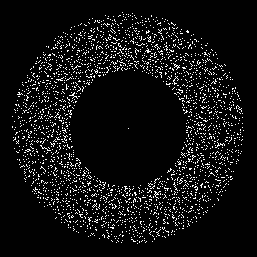
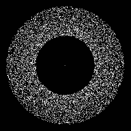
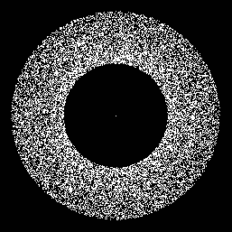
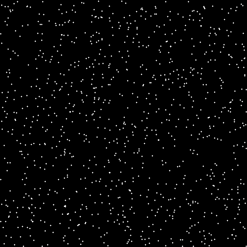
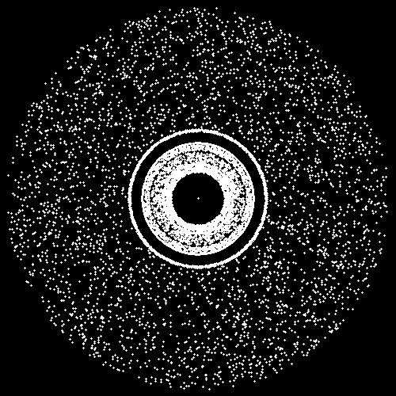
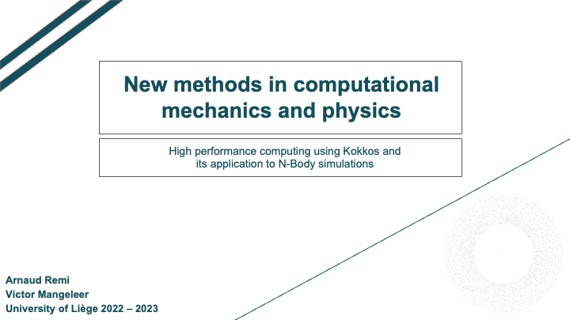

<b style="font-size:30vw;">Introduction to Kokkos and its application to N-BODY simulations</b>

In this repository, you will find the code for our project for the course of *New Methods in Computational Mechanics and Physics*. It contains:

- A C++ code implementing a N-BODY simulator;
- A C++ code using **Kokkos** implementing a N-BODY simulator;
- A python code allowing to generate datasets as .txt files
- A python code to create *gif* from the results obtained.

Simulations

| 5000 | 10000 | 20000 |
|:-:|:-:|:-:|
||||
| Planets (1) | Planets (2) |  Gas |
||||
| Galaxy (2) | Galaxy (3) | Galaxy (3 - Inverse force) |
||||

Installation & Overview

The repository is composed as follows:

1) In the *src* folder, you'll find *main.cpp* which contains the code for the N-BODY simulator in c++ using Kokkos.

2) In the *content/codes* folder, you'll find the files *original.cpp* (a pure c++ version of the N-BODY simulation) and *kokkos.cpp* (a c++ and kokkos simulator which is almost identical to *original.cpp* to make easy comparisons);

3) The code *galaxy.py* used to generate new simulation datasets;

4) The code *benchmarks.py* used to compute the bandwidth and speed-up graphs.

5) The code *vizualize.py* used to create gif from the simulation results.

Presentation

